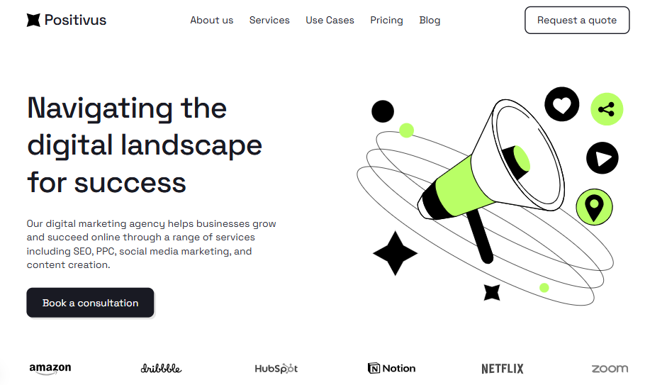

# Positivus Landing Page Design (Community)



## Descrição

Landing page da agência Positivus reproduzida fielmente a partir do design do Figma. Este é um projeto comunitário que demonstra a implementação das primeiras seções de uma página de agência de marketing digital.

### Seções implementadas

- **Hero**: Navegação, texto principal, logos de clientes
- **Services**: 6 cards de serviços (SEO, PPC, Social Media, Email, Content, Analytics)
- **Case Studies**: 3 casos de sucesso com resultados
- **CTA**: Seção de contato "Let's make things happen"

### Stack

- Next.js 16 + React 19
- Tailwind CSS 4
- TypeScript
- Lucide React (ícones)
- Vercel Analytics

## Requisitos

- Node.js 18+
- pnpm 8+

## Como executar

```bash
# Instalar dependências
pnpm install

# Development
pnpm dev

# Build
pnpm build

# Start em produção
pnpm start

# Formatar código
pnpm format

# Checar formatação
pnpm lint
```

## Referência

- [Link do Figma](https://www.figma.com/design/QGCJc8PeG7Gk0rPpx8028f/Positivus-Landing-Page-Design--Community-?node-id=333-1290&t=r5Mx3dl4VV66u0r5-0)
