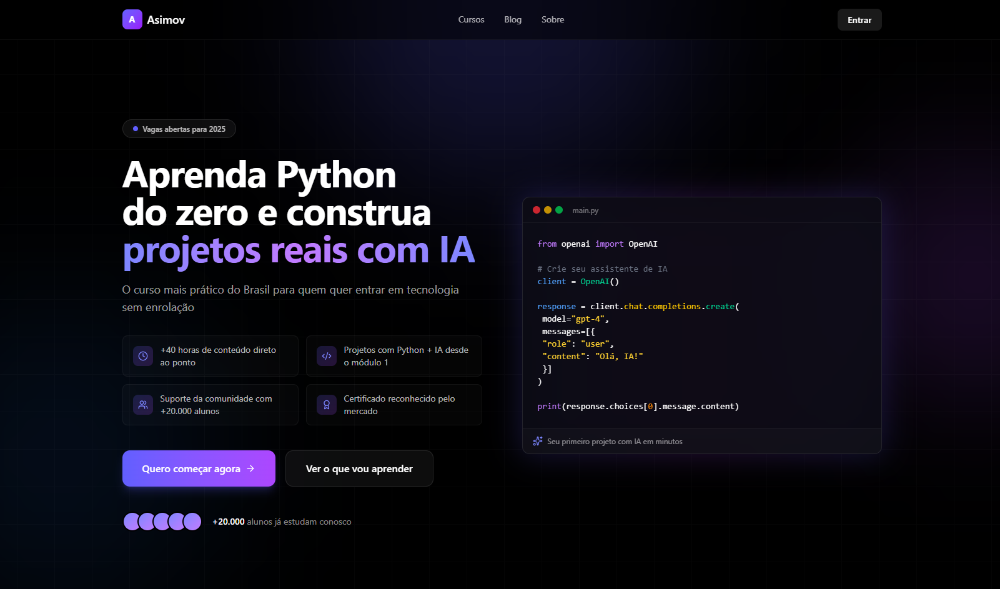

# Asimov Landing Page



## Descrição

Landing page da Asimov Academy para curso de Python e IA. Seção hero com informações do curso, benefícios e chamada para ação. Criada a partir de descrição textual (especificações do teste) utilizando v0.app (com assistência do Google Gemini).

### Protótipo (v0.app)

- **URL**: https://v0-curso-python-ia.vercel.app/

### Seções implementadas

- **Navbar**: Navegação fixa com menu responsivo
- **Hero**: Seção principal com headline, subheadline, benefícios e CTAs

### Stack

- Next.js 16 + React 19
- Tailwind CSS 4
- TypeScript
- Lucide React (ícones)
- Vercel Analytics

## Requisitos

- Node.js 18+
- pnpm 8+

## Como executar

```bash
# Instalar dependências
pnpm install

# Development
pnpm dev

# Build
pnpm build

# Start em produção
pnpm start

# Formatar código
pnpm format

# Checar formatação
pnpm lint
```

## Referência

- [Asimov Academy](https://asimov.academy)
- [Linear](https://linear.app)
- [Frame.io](https://frame.io)
- [Isomeet](https://www.isomeet.com)
- [Antimetal](https://antimetal.com)
